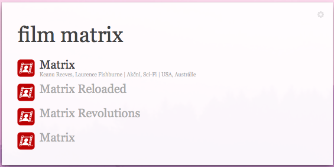

alfred-csfd-suggest
===================

[csfd](csfd.cz) workflow for alfred

You will need [node.js](http://nodejs.org/) to for it to work.

Language is set by default to bin/zsh, but if zsh is not your default prompt, you might need to change this to bash. (just open the script filter and change it)

Be sure that you dont trigger it too often as csfd might block your IP then.

## License

MIT © [Daniel Husar](https://github.com/danielhusar)